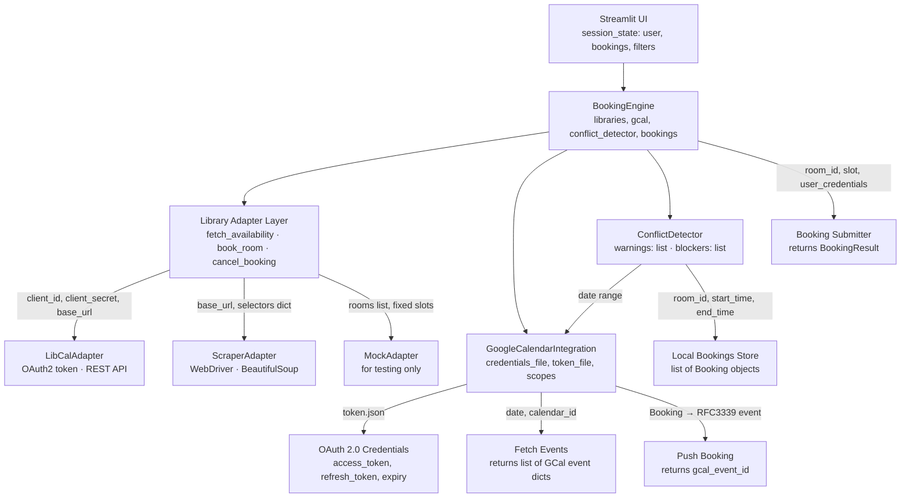
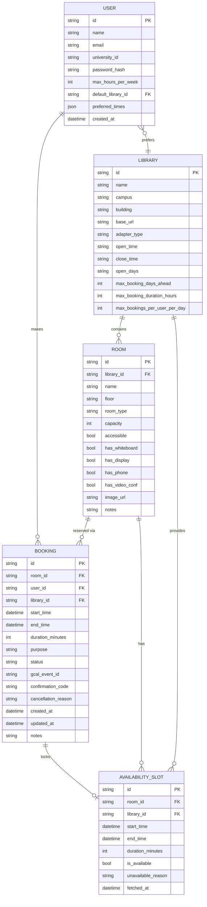
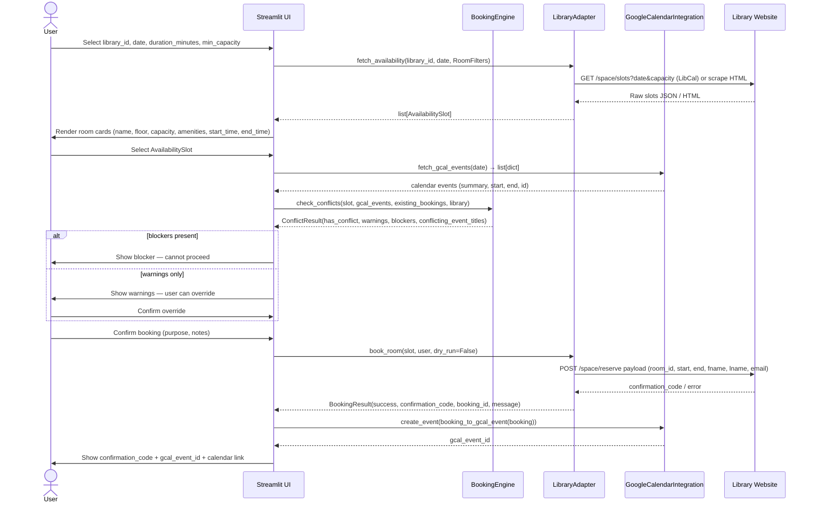
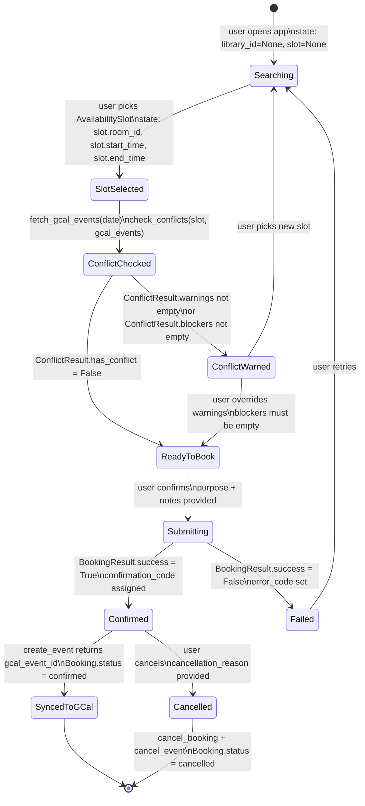
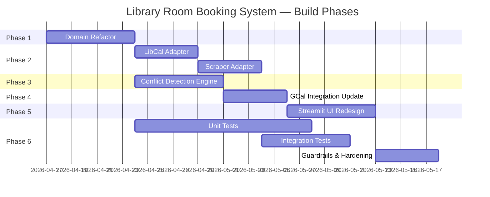

# Library Room Booking System — Diagrams

## 1. System Architecture

---

## 2. Entity-Relationship Diagram

---

## 3. Full Domain Class Diagram

```mermaid
classDiagram
    class User {
        +id: str
        +name: str
        +email: str
        +university_id: str
        +password_hash: str
        +default_library_id: str
        +max_hours_per_week: int
        +preferred_times: dict
        +created_at: datetime
    }

    class Library {
        +id: str
        +name: str
        +campus: str
        +building: str
        +base_url: str
        +adapter_type: str
        +open_time: str
        +close_time: str
        +open_days: list~str~
        +max_booking_days_ahead: int
        +max_booking_duration_hours: int
        +max_bookings_per_user_per_day: int
    }

    class Room {
        +id: str
        +library_id: str
        +name: str
        +floor: str
        +room_type: str
        +capacity: int
        +accessible: bool
        +has_whiteboard: bool
        +has_display: bool
        +has_phone: bool
        +has_video_conf: bool
        +image_url: str
        +notes: str
    }

    class Booking {
        +id: str
        +room_id: str
        +user_id: str
        +library_id: str
        +start_time: datetime
        +end_time: datetime
        +duration_minutes: int
        +purpose: str
        +status: str
        +gcal_event_id: str
        +confirmation_code: str
        +cancellation_reason: str
        +created_at: datetime
        +updated_at: datetime
        +notes: str
    }

    class AvailabilitySlot {
        +id: str
        +room_id: str
        +library_id: str
        +start_time: datetime
        +end_time: datetime
        +duration_minutes: int
        +is_available: bool
        +unavailable_reason: str
        +fetched_at: datetime
    }

    class RoomFilters {
        +min_capacity: int
        +max_capacity: int
        +amenities: list~str~
        +accessible_only: bool
        +duration_minutes: int
        +room_type: str
        +floor: str
    }

    class BookingResult {
        +success: bool
        +confirmation_code: str
        +booking_id: str
        +message: str
        +error_code: str
        +raw_response: dict
    }

    class ConflictResult {
        +has_conflict: bool
        +warnings: list~str~
        +blockers: list~str~
        +conflicting_event_titles: list~str~
        +conflicting_booking_ids: list~str~
    }

    class BookingEngine {
        +libraries: dict~str_BaseLibraryAdapter~
        +gcal: GoogleCalendarIntegration
        +conflict_detector: ConflictDetector
        +bookings: list~Booking~
        +fetch_availability(library_id, date, filters) list~AvailabilitySlot~
        +check_conflicts(slot, user_id) ConflictResult
        +book_room(slot, user, dry_run) BookingResult
        +cancel_booking(booking_id, reason) bool
        +get_user_bookings(user_id) list~Booking~
    }

    class ConflictDetector {
        +detect(slot, gcal_events, existing_bookings, library) ConflictResult
        -_check_gcal_overlap(slot, events) list~str~
        -_check_room_double_book(slot, bookings) list~str~
        -_check_operating_hours(slot, library) list~str~
        -_check_advance_limit(slot, library) list~str~
        -_check_duration_limit(slot, library) list~str~
        -_check_user_daily_limit(slot, user_id, bookings, library) list~str~
    }

    class GoogleCalendarIntegration {
        +credentials_file: str
        +token_file: str
        +scopes: list~str~
        +calendar_id: str
        +authenticate() Credentials
        +fetch_gcal_events(date) list~dict~
        +booking_to_gcal_event(booking) dict
        +gcal_event_to_booking(event) Booking
        +create_event(event_dict) str
        +cancel_event(event_id) bool
        +check_gcal_conflicts(slot, gcal_events) ConflictResult
    }

    class BaseLibraryAdapter {
        <<abstract>>
        +library_id: str
        +config: dict
        +request_timeout: int
        +max_retries: int
        +requests_per_minute: int
        +fetch_availability(date, filters) list~AvailabilitySlot~
        +book_room(slot, user) BookingResult
        +cancel_booking(confirmation_code) bool
        #_rate_limit()
        #_retry(fn, retries) any
        #_check_robots_txt(url) bool
    }

    class LibCalAdapter {
        +base_url: str
        +client_id: str
        +client_secret: str
        +api_version: str
        -_token: str
        -_token_expiry: datetime
        +fetch_availability(date, filters) list~AvailabilitySlot~
        +book_room(slot, user) BookingResult
        +cancel_booking(confirmation_code) bool
        -_authenticate() str
        -_parse_slots(raw_json) list~AvailabilitySlot~
        -_build_reserve_payload(slot, user) dict
    }

    class ScraperAdapter {
        +base_url: str
        +selectors: dict
        +request_delay_seconds: float
        -_driver: WebDriver
        +fetch_availability(date, filters) list~AvailabilitySlot~
        +book_room(slot, user) BookingResult
        +cancel_booking(confirmation_code) bool
        -_load_page(url) str
        -_parse_html(html) list~AvailabilitySlot~
        -_fill_booking_form(slot, user)
        -_extract_confirmation(page_source) str
    }

    class MockAdapter {
        +rooms: list~Room~
        +fixed_slots: list~AvailabilitySlot~
        +always_confirm: bool
        +simulated_error: str
        +fetch_availability(date, filters) list~AvailabilitySlot~
        +book_room(slot, user) BookingResult
        +cancel_booking(confirmation_code) bool
    }

    BookingEngine --> ConflictDetector
    BookingEngine --> GoogleCalendarIntegration
    BookingEngine --> BaseLibraryAdapter
    BookingEngine --> Booking
    ConflictDetector --> ConflictResult
    ConflictDetector --> GoogleCalendarIntegration
    BaseLibraryAdapter <|-- LibCalAdapter
    BaseLibraryAdapter <|-- ScraperAdapter
    BaseLibraryAdapter <|-- MockAdapter
    BaseLibraryAdapter --> AvailabilitySlot
    BaseLibraryAdapter --> BookingResult
    User --> Booking
    Room --> Booking
    Room --> AvailabilitySlot
    Library --> Room
    Library --> AvailabilitySlot
    Booking --> BookingResult
    BookingEngine --> RoomFilters
```

---

## 4. Booking Flow (Sequence Diagram)

---

## 5. Booking State Machine

---

## 6. Phase Timeline (Gantt)

