## Library Room Booking System - Final UML Class Diagram

```mermaid
classDiagram
    class User {
        +str id
        +str name
        +str email
        +str university_id
        +str password_hash
        +str default_library_id
        +int max_hours_per_week
        +dict preferred_times
        +datetime created_at
    }

    class Library {
        +str id
        +str name
        +str campus
        +str building
        +str base_url
        +str adapter_type
        +str open_time
        +str close_time
        +list open_days
        +int max_booking_days_ahead
        +int max_booking_duration_hours
        +int max_bookings_per_user_per_day
    }

    class Room {
        +str id
        +str library_id
        +str name
        +str floor
        +str room_type
        +int capacity
        +bool accessible
        +bool has_whiteboard
        +bool has_display
        +bool has_phone
        +bool has_video_conf
        +str image_url
        +str notes
    }

    class AvailabilitySlot {
        +str id
        +str room_id
        +str library_id
        +datetime start_time
        +datetime end_time
        +int duration_minutes
        +bool is_available
        +str unavailable_reason
        +datetime fetched_at
        +dict metadata
    }

    class RoomFilters {
        +int min_capacity
        +int max_capacity
        +list amenities
        +bool accessible_only
        +int duration_minutes
        +str room_type
        +str floor
    }

    class Booking {
        +str id
        +str room_id
        +str user_id
        +str library_id
        +datetime start_time
        +datetime end_time
        +int duration_minutes
        +str purpose
        +str status
        +str gcal_event_id
        +str confirmation_code
        +str cancellation_reason
        +datetime created_at
        +datetime updated_at
        +str notes
    }

    class BookingResult {
        +bool success
        +str confirmation_code
        +str booking_id
        +str message
        +str error_code
        +dict raw_response
    }

    class ConflictResult {
        +bool has_conflict
        +list warnings
        +list blockers
        +list conflicting_event_titles
        +list conflicting_booking_ids
    }

    class BookingStore {
        +str db_path
        +save(booking) void
        +update_status(booking_id, status, reason) bool
        +update_gcal_event_id(booking_id, gcal_event_id) void
        +load_all() list
        +count() int
        +close() void
    }

    class ConflictDetector {
        +detect(slot, gcal_events, existing_bookings, library) ConflictResult
        -_check_gcal_overlap(slot, events) list
        -_check_room_double_book(slot, bookings) list
        -_check_operating_hours(slot, library) list
        -_check_advance_limit(slot, library) list
        -_check_duration_limit(slot, library) list
        -_check_user_daily_limit(slot, user_id, bookings, library) list
    }

    class GoogleCalendarIntegration {
        +str credentials_file
        +str token_file
        +list scopes
        +str calendar_id
        +authenticate() Credentials
        +fetch_gcal_events(date) list
        +booking_to_gcal_event(booking) dict
        +create_event(event_dict) str
        +cancel_event(event_id) bool
        +check_gcal_conflicts(slot, gcal_events) ConflictResult
    }

    class BaseLibraryAdapter {
        <<abstract>>
        +str library_id
        +dict config
        +int request_timeout
        +int max_retries
        +int requests_per_minute
        +fetch_availability(date, filters) list
        +book_room(slot, user) BookingResult
        +cancel_booking(confirmation_code) bool
    }

    class LibCalAdapter {
        +str base_url
        +str client_id
        +str client_secret
        +str api_version
        -str _token
        -datetime _token_expiry
        +fetch_availability(date, filters) list
        +book_room(slot, user) BookingResult
        +cancel_booking(confirmation_code) bool
    }

    class ScraperAdapter {
        +str base_url
        +dict selectors
        +float request_delay_seconds
        +fetch_availability(date, filters) list
        +book_room(slot, user) BookingResult
        +cancel_booking(confirmation_code) bool
    }

    class MockAdapter {
        +list rooms
        +list fixed_slots
        +bool always_confirm
        +str simulated_error
        +fetch_availability(date, filters) list
        +book_room(slot, user) BookingResult
        +cancel_booking(confirmation_code) bool
    }

    class AIAssistant {
        +parse_booking_request(user_input, today) tuple
        +suggest_alternative(conflict_messages, available_slots, library_name) str
        +suggest_booking_prompt(user_input) str
        +get_reasoning_trace() list
        +print_reasoning_trace(verbose) str
        +get_reasoning_json() dict
    }

    class BookingEngine {
        +dict libraries
        +GoogleCalendarIntegration gcal
        +ConflictDetector conflict_detector
        +BookingStore store
        +list bookings
        +fetch_availability(library_id, date, filters) list
        +check_conflicts(slot, user_id) ConflictResult
        +book_room(slot, user, dry_run) BookingResult
        +cancel_booking(booking_id, reason) bool
        +get_user_bookings(user_id) list
    }

    User "1" --> "0..*" Booking : creates
    Library "1" --> "0..*" Room : contains
    Room "1" --> "0..*" AvailabilitySlot : offers
    Room "1" --> "0..*" Booking : reserved_as
    Library "1" --> "0..*" AvailabilitySlot : publishes

    BookingEngine --> BaseLibraryAdapter : dispatches to
    BookingEngine --> ConflictDetector : validates with
    BookingEngine --> GoogleCalendarIntegration : syncs with
    BookingEngine --> BookingStore : persists via
    BookingEngine --> Booking : manages
    BookingEngine --> ConflictResult : returns
    BookingEngine --> BookingResult : returns

    ConflictDetector --> Booking : reads existing
    ConflictDetector --> ConflictResult : builds
    ConflictDetector --> GoogleCalendarIntegration : checks overlaps

    BaseLibraryAdapter <|-- LibCalAdapter
    BaseLibraryAdapter <|-- ScraperAdapter
    BaseLibraryAdapter <|-- MockAdapter

    BookingStore --> Booking : rehydrates
    AIAssistant ..> RoomFilters : produces filters
    AIAssistant ..> BookingEngine : supports workflow
```

## Detailed Description

### 1. Core Domain Layer

- User represents the person booking rooms and stores profile and preference data.
- Library holds policy constraints used by conflict checks, including hours, max duration, and booking limits.
- Room defines the physical bookable resource with attributes used for filtering.
- AvailabilitySlot is a candidate time window returned by adapters before booking confirmation.
- Booking is the final reservation entity persisted in SQLite and optionally linked to Google Calendar.

### 2. Application Service Layer

- BookingEngine orchestrates the end-to-end workflow: fetch slots, validate conflicts, submit booking, persist state, and cancel bookings.
- ConflictDetector enforces guardrails and policies:
  - room double-book prevention
  - library operating hours
  - advance booking windows
  - max booking duration
  - per-user daily limits
  - calendar overlap warnings

### 3. Infrastructure Layer

- BaseLibraryAdapter defines a common contract so multiple external providers can be swapped without changing BookingEngine.
- LibCalAdapter implements SpringShare API integration.
- ScraperAdapter implements HTML-based slot extraction and booking automation.
- MockAdapter provides deterministic behavior for local development and tests.
- BookingStore provides durable persistence and reload support through SQLite.
- GoogleCalendarIntegration handles OAuth, event retrieval, event creation, and cancellation.

### 4. AI Assistance Layer

- AIAssistant converts natural-language user prompts into structured RoomFilters.
- It also generates alternative suggestions when conflicts occur and coaching prompts for low-quality inputs.
- Agentic reasoning trace utilities expose intermediate decision steps for transparency and debugging.

### 5. End-to-End Control Flow

1. UI gathers filters manually or through AIAssistant parse.
2. BookingEngine fetches AvailabilitySlot data through the selected adapter.
3. ConflictDetector evaluates warnings and blockers against policy, local bookings, and calendar events.
4. If valid, BookingEngine confirms booking through adapter and stores it via BookingStore.
5. GoogleCalendarIntegration syncs confirmed bookings and handles cancellation cleanup.
6. Sidebar booking history is read from persisted state and reflects status transitions in real time.
